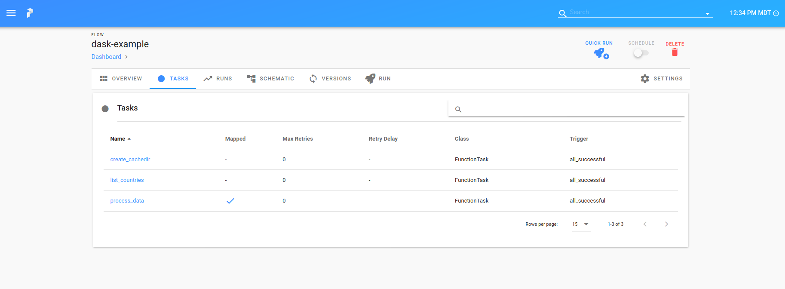

# Dask Local

And possibly adding prefect, because it [seems really nice](https://docs.prefect.io/core/advanced_tutorials/dask-cluster.html).

## Test Case 2: Local Testing with Dask

Let's take an approach that if we can start Dask either locally or on our cluster
and then have a scheduler interact with slurm (directly or via ssh) this might be a hacky
solution to get a job manager and interface, at least in user space. 

### 1. Prepare Local Environment

Let's again prepare a local environment. Yes, this is a lot of Python files,
but at least we are being somewhat modular.

```bash
python -m venv env
source env/bin/activate
pip install  -r requirements.txt
```

### 2. Start the dask scheduler

As a sanity check, make sure the `dask-scheduler` is still on your path.

```bash
$ which dask-scheduler
/home/vanessa/Desktop/Code/test-dask/dask-local/env/bin/dask-scheduler
```

Let's again start a dask scheduler and a dask worker (on the cluster the worker would
technically be a node I think, and I'm not sure if we would need to start it on job
submission). For now, just do this simple approach. If you didn't pkill

```bash
DASK_HOST=127.0.0.1
DASK_PORT=8786

dask-scheduler --host $DASK_HOST --port $DASK_PORT &
dask-worker $DASK_HOST:$DASK_PORT &
```

If you didn't kill these processes before, you'll get an OS error that they are already running.
You can also open up the dashboard like so:

```bash
dask-scheduler --dashboard
```

You should be able to navigate to [127.0.0.1:8787](127.0.0.1:8787) to see the dask interface.

### 3. The Application

We could do something stupid, but instead let's use the [covid-world-scraper](https://github.com/biglocalnews/covid-world-scraper)
and see if we can get dask to run a scraping task. We'll need to download a release of
the [Geckodriver](https://github.com/mozilla/geckodriver/releases) and make sure it's in the path,
along with installing the software:

```bash
pip install git+https://github.com/biglocalnews/covid-world-scraper#egg=covid-world-scraper
```

I first tested a [simple script](simple.py) to scrape for a single country, and save to a folder
in the present working directory (this seemed to work!) and then I made a more typical
workflow with Dask and Prefect. I also started the local prefect server (so it would register in the interface),
and note that this requires docker / docker-compose.

```bash
prefect backend server
prefect server start
```

It seemed to work! Here is the command line:

```bash
$ python workflow.py 
[2020-07-26 18:03:00] INFO - prefect.FlowRunner | Beginning Flow run for 'dask-example'
[2020-07-26 18:03:00] INFO - prefect.FlowRunner | Starting flow run.
distributed.scheduler - INFO - Receive client connection: Client-3e39c1c8-cf6a-11ea-9376-af0459866c10
distributed.core - INFO - Starting established connection
[2020-07-26 18:03:00] INFO - prefect.TaskRunner | Task 'create_cachedir': Starting task run...
[2020-07-26 18:03:00] INFO - prefect.TaskRunner | Task 'create_cachedir': finished task run for task with final state: 'Success'
[2020-07-26 18:03:00] INFO - prefect.TaskRunner | Task 'list_countries': Starting task run...
[2020-07-26 18:03:00] INFO - prefect.TaskRunner | Task 'list_countries': finished task run for task with final state: 'Success'
[2020-07-26 18:03:00] INFO - prefect.TaskRunner | Task 'List': Starting task run...
[2020-07-26 18:03:00] INFO - prefect.TaskRunner | Task 'List': finished task run for task with final state: 'Success'
[2020-07-26 18:03:00] INFO - prefect.TaskRunner | Task 'process_data': Starting task run...
[2020-07-26 18:03:00] INFO - prefect.TaskRunner | Task 'process_data': finished task run for task with final state: 'Mapped'
[2020-07-26 18:03:00] INFO - prefect.TaskRunner | Task 'process_data[0]': Starting task run...
Processing BRA
...
```

And I had a little web interface to keep track of jobs.



And I would hope that this would scale appropriately on a slurm cluster, which we would want to test next.
We wouldn't, however, easily be able to use the dashboard, as it requires docker and docker-compose.

### 4. Clean up

Before moving to the cluster don't forget to clean up jobs.

```bash
kill -9 12733
kill -9 12734
```

It looks like Graphviz is also required to be able to create the plot.
I also found that I can start a prefect interface with `prefect server start`.

## Test Case 3: Slurm Testing

On the sherlock cluster, let's clone the repository and again create a virtual python
environment.

```bash
git clone https://github.com/researchapps/testing-dask
cd testing-dask/dask-local
python3 -m venv env
source env/bin/activate
pip install  -r requirements.txt
```


```bash
from dask_jobqueue import SLURMCluster
from distributed import Client
import os

# Assumes part of owners group / partition
cluster = SLURMCluster(memory='8g',
                       processes=1,
                       queue="owners",
                       scheduler_options={'dashboard_address': ':12443'},
                       local_directory=os.getcwd(),
                       cores=2)

cluster.start_workers(2)
client = Client(cluster)
print(client)
<Client: 'tcp://171.66.103.154:37349' processes=0 threads=0, memory=0 B>
```

Note that I ran this in one interactive session, and then I wanted to test
running a specific job (the workflow we ran previously) from another shell.

```bash
export DASK_EXECUTOR=tcp://171.66.103.154:37349
python workflow.py
```

We can get the host address when we print the client.

```bash
print(client.dashboard_link)
'http://171.66.103.154:12443/status'
```

Theoretically you could try to create an ssh tunnel to see the dashboard, but I
couldn't get it working. I'm not sure if this is allowed anymore. The command
typically looks something like

```bash
PORT=12443
RESOURCE=mycluster
MACHINE=node.mycluster.edu
ssh -L $PORT:localhost:$PORT ${RESOURCE} ssh -L $PORT:localhost:$PORT -N "$MACHINE"
```

This didn't actually seem to work. Bummer. But we should still be able to run jobs.
